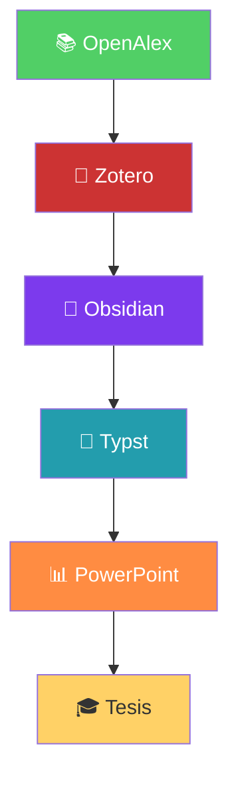
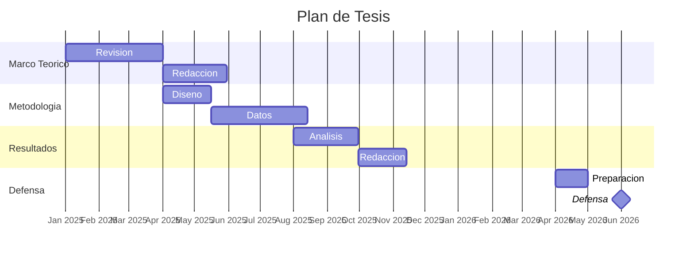
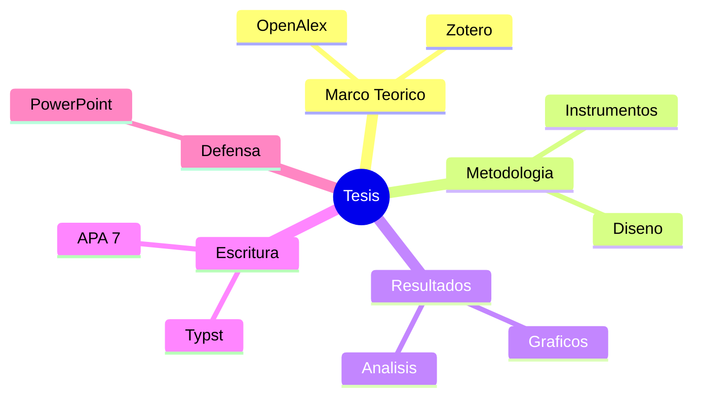

# 🎯 Diagramas Mermaid para tu Tesis

## 🔄 Flujo de trabajo

```mermaid
graph TD
    A["📚 OpenAlex"] --> B["📖 Zotero"]
    B --> C["📝 Obsidian"]
    C --> D["🦀 Typst"]
    D --> E["📊 PowerPoint"]
    E --> F["🎓 Tesis"]
    
    style A fill:#51CF66,color:#fff
    style B fill:#CC3333,color:#fff
    style C fill:#7C3AED,color:#fff
    style D fill:#239DAD,color:#fff
    style E fill:#FF8C42,color:#fff
    style F fill:#FFD166,color:#333
```

## 🗓️ Cronograma

```mermaid
gantt
    title Plan de Tesis
    dateFormat YYYY-MM-DD
    axisFormat %b %Y
    section Marco Teorico
    Revision :a1, 2025-01-01, 90d
    Redaccion :a2, after a1, 60d
    section Metodologia
    Diseno :b1, 2025-04-01, 45d
    Datos :b2, after b1, 90d
    section Resultados
    Analisis :c1, 2025-08-01, 60d
    Redaccion :c2, after c1, 45d
    section Defensa
    Preparacion :d1, 2026-04-01, 30d
    Defensa :milestone, 2026-06-01, 0d
```

## 🧠 Mapa mental

```mermaid
mindmap
  root((Tesis))
    Marco Teorico
      OpenAlex
      Zotero
    Metodologia
      Diseno
      Instrumentos
    Resultados
      Analisis
      Graficos
    Escritura
      Typst
      APA 7
    Defensa
      PowerPoint
```

> Creado por Hermes Thesis Hub · [[Bienvenido]] · #diagramas #mermaid